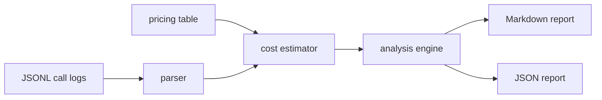

# llm-cost-lens

`llm-cost-lens` is a small CLI for inspecting LLM API logs before cost surprises become production problems. It reads JSONL call records, estimates spend, summarizes token and latency patterns, and flags unusually large or slow requests.

It is built for teams that already store OpenAI-compatible request logs but do not want to ship those logs into a heavy observability platform just to answer: "what changed, what cost money, and which call was weird?"

## Features

- parses one-call-per-line JSONL logs from chat, responses, or batch jobs
- estimates cost from a configurable model pricing file
- groups spend by model, team, or endpoint
- reports average and p95 latency, error rate, and budget usage
- flags token spikes with z-score detection and slow calls with a fixed threshold
- emits Markdown for humans or JSON for automation

## Installation

```bash
python -m pip install -e .
```

For development:

```bash
python -m pip install -e ".[dev]"
```

## Usage

Analyze the included sample log:

```bash
llm-cost-lens examples/openai_calls.jsonl --budget 0.25 --latency-threshold-ms 5000
```

Group by team and save JSON for a pipeline:

```bash
llm-cost-lens examples/openai_calls.jsonl \
  --group-by team \
  --format json \
  --output report.json
```

Use your own pricing file:

```bash
llm-cost-lens production-calls.jsonl --pricing examples/pricing.json
```

Accepted log shape:

```json
{
  "timestamp": "2026-06-25T08:00:01Z",
  "request_id": "req_001",
  "model": "gpt-4o-mini",
  "team": "support",
  "endpoint": "chat.completions",
  "latency_ms": 820,
  "status": "ok",
  "usage": {
    "prompt_tokens": 1200,
    "completion_tokens": 280
  }
}
```

The parser also accepts `input_tokens` and `output_tokens` aliases.

## CLI options

```text
--pricing PATH              JSON pricing file keyed by model name
--budget USD                budget for the analyzed log window
--group-by model|team|endpoint
--latency-threshold-ms MS   flag calls slower than this value
--anomaly-zscore FLOAT      token spike sensitivity, default 2.5
--format markdown|json
--output PATH               write report to a file
```

## Workflow



## Tests

```bash
ruff check .
pytest
python -m llm_cost_lens --help
```

## License

MIT
