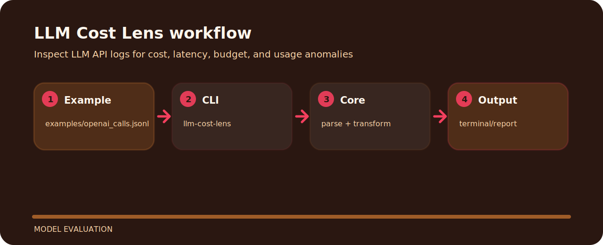

# LLM Cost Lens


LLM Cost Lens focuses on one practical job in model evaluation. The README below is arranged around the shortest path from clone to result.

## Shape of the tool



## Run it

```bash
git clone https://github.com/mertefekurt/llm-cost-lens.git
cd llm-cost-lens
python -m pip install -e ".[dev]"
llm-cost-lens examples/openai_calls.jsonl
```

## Useful details

The project stays useful because of these small constraints:

- Designed as a focused model evaluation repo.
- Keeps setup short.
- Prioritizes readable output over infrastructure.

## Before a release

```bash
ruff check .
pytest
python -m llm_cost_lens --help
```
